# **PROYECTO "MOTIVAME"**

Reto realizado de manera individual, el reto consiste en diseñar una App que cumpla con las espectativas de los usuarios, al momento de buscar motivaciones que ayuden a mantener firme la desición de llevar una vid saludable. Se realizará un proceso de investigación y planeamiento estratégico, y con este conocimiento se identificará las principales necesidades del usuario.

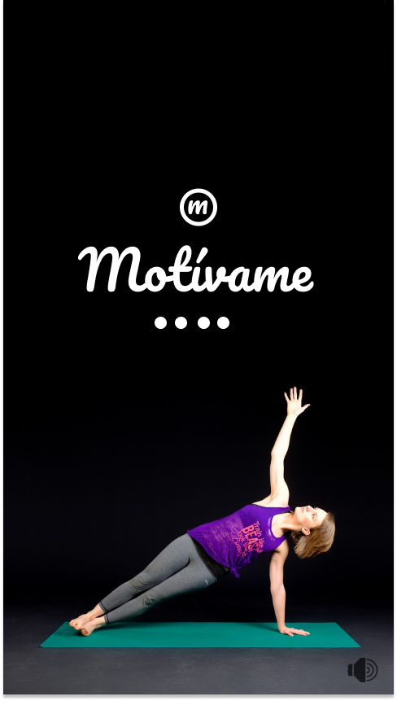

## **OBJETIVOS**
### **Objetivo principal:**
Diseñar una App que acompañe y motive a los usuari@s en el proceso de cambiar a un estilo de vida saludable
### **Objetivo secundario:** 
Dar a conocer las diferentes consecuencias que traen a corto y largo plazo tener un estilo de vida poco saludable.

## **RESEARCH**

#### Objetivos de las App dedicadas a este rugro

Las diferentes alternatvas que tenemos en le mercado de estilo de vida saludable presentan múltiples funciones e interacciones con el usuari@, muchas de ellas presentan:

- Textos confusos.
- Solo se dedican a contar calorias de cada alimento que podemos consumir.
- no tienen claro el flujo de la App.
- No presentan motivaciones suficientes.
- No dan informacion convincente.
- La mayoria son para aumentar **% ICM**.
- Los uso una vez y de ahy ya no me dan ganas de volver a abrirlos.

## **Proceso de Ideación** ##
**¿ Cómo se hizo el Prototipo de Contenido ?**

#### 1.- Elaboración de propuestas de : Features list 
 

| |                       |
| ---------- | ---------- |
| Técnica   | Elaboración de cuadro   |
| Responsabilidad   | Silvia Puente de la Vega Vilca   | 
| Fecha   | 14/03/2018 a 15/03/2018   |
| Tiempo   | 60 min.   | 

#### 2.- Feedback de propuestas:

| |                       |
| ---------- | ---------- |
| Técnica-1  | Revisión de los objetivos del proyecto   |
| Técnica-2  | revision de bibliografia virtual.   |
| Responsabilidad   | Silvia Puente de la Vega Vilca   | 
| Fecha   | 16/03/2018   |
| Tiempo   | 120 min.   | 

#### 3.- Elaboración y propuesta de Prototipo de contenido

| |                       |
| ---------- | ---------- |
| Técnica   | Escribir posibles notas   |
| Técnica-2  | Redacción del flujo de la app.   |
| Responsabilidad   | Silvia Puente de la Vega Vilca   | 
| Fecha   | 17/03/2018   |
| Tiempo   | 120 min.   | 

#### 4.- Testeo de prototipo de contenido  a un grupo de usuarias seleccionada (público objetivo) para recibir feedback

| |                       |
| ---------- | ---------- |
| Técnica   | Exposición verbal directa una a una.   |
| Técnica-2  | Toma de notas.   |
| Responsabilidad   | Silvia Puente de la Vega Vilca   | 
| Fecha   | 19/03/2018   |
| Tiempo   | 10min c/una.   | 
Responsables de revisión:      

	  Gonzalo (teacher)
      Gabriela Segura(teacher)
      Silvia Puente de la Vega Vilca

#### 5.- Feedback de primer testeo.

| |                       |
| ---------- | ---------- |
| Técnica   | Análisis de feedback de los usuarios seleccionado|
| Responsabilidad   | Silvia Puente de la Vega Vilca   | 
| Fecha   | 20/03/2018   |
| Tiempo   | 60 min.   | 

#### 6.- Actualización del cuadro de Exploración Brainstorming con técnicas : ( Features )

| |                       |
| ---------- | ---------- |
| Técnica   | Recopilación y revisión de 							 diapositivas de clase.   |
| Responsabilidad   | Silvia Puente de la Vega Vilca   | 
| Fecha   | 20/03/2018   |
| Tiempo   | 40 min.   | 

Responsables de revisión:      

	  Gonzalo (teacher)
      Gabriela Segura(teacher)
      Silvia Puente de la Vega Vilca

#### Actividades con los usuarios.

##### Entrevistas personales.

Se realizaron entrevistas a 7 usuarios, en las que se les planto pregunstas abiertas y alternativas. Y que nos cuenten sus experiencias con las otras plataformas.

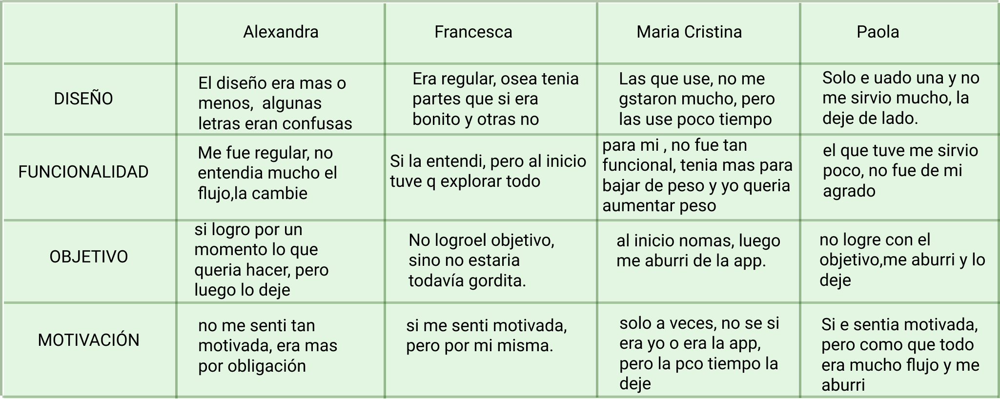
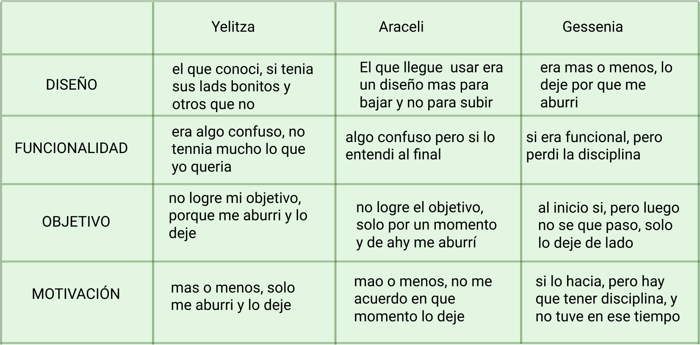

**Conclusiones**

- Las usuarias no estan conforme con lo que les ofrece las aplicaciones convencionales.
- Los contenidos de los flujos no son tan claros como ellas esperaban.
- Solo encontraron más información para un tipo de objetvo puntual (disminución de % ICM), cuando ellas tenian como objetivo aumentar este porcentaje.
- El diseño no es de su gusto, resaltan lo confuso que les pareció.
- La motivación por permanecer en rutina, solo les duró un tiempo corto, no pudieron mantener firme esa desición.

##### Encuestas virtuales.

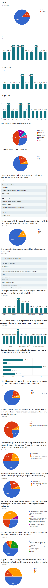

**Conclusiones de la encuesta virtual**

- La mayoría de los usuarios conoce la relacion peso-estatura, pero no es consciente realmente los riesgos que incluye no estar sobre estos rangos.
- No llevan un adecuado control de su peso. No recuerdan o fue hace mucho tiempo que se hicieron un control de peso.
- El 71.4% de los usuarios piensa que solo intentar comer sano ayuda a ua vida saludable.
- El 786% de los usuarios ha tenido alguna experiencia con alguna App relacionada con el control de peso y/o vida saludable.
- El 71.4% de los usuarios cree que si le ofrecen descuentos que los puedan usar en diferentes categorias de consumo, se sentirian muy motivados a mantenerse firme con su descicion de vida saludable.
- el 71.4% siente necesario incluir un contador de caloria que le ayude a controlar el % de caloria que consume o va consumir.
- el 42.9% cree que el hecho de sentirse bien, con mas ganas es suficiente motivación, mientras que el 28.6% cree que verse en una imagen: antes y despues, le ayudaria bastante mantenerse en disciplina.
- El 64.3% se anima a tener un partner que le ayude en este proceso, pero solo el 50% estaria a ser este partner que colabore con mantenerse disciplinado.

### BENCHMARCK

Para realizar el Benchmarck, se tomó en cuenta a las diferents App que hay en el mercado virtual, se evaluaron al detalle tres de ellas, estas aplicaciones fueron elegidas bajo el criterio de priorizacion que las usuari@s mencionaron, indistintamente al obejtivo que cada un@ tenia. 

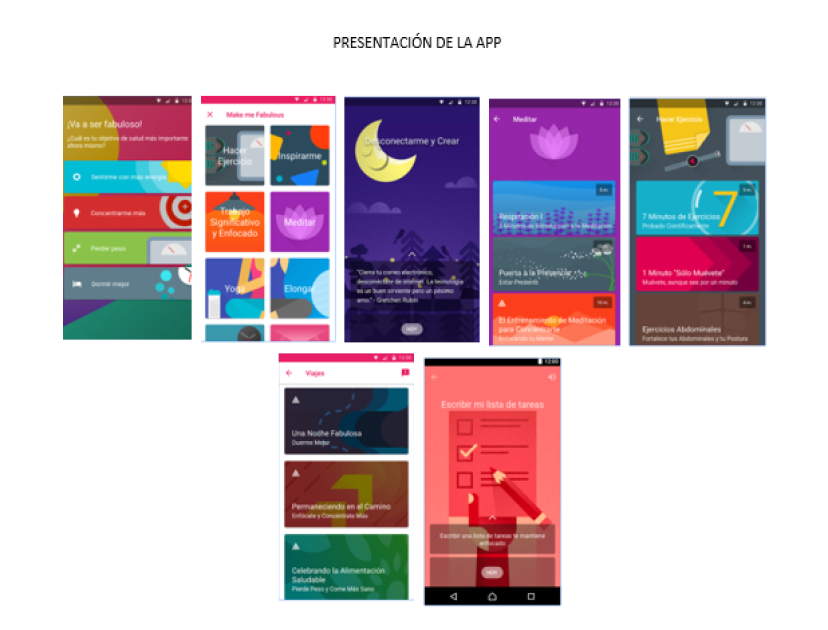
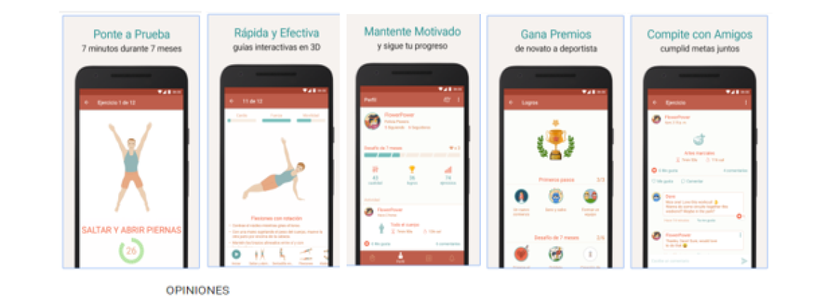
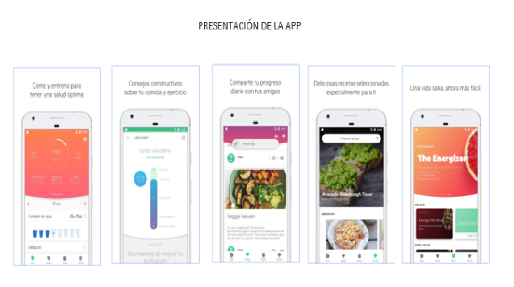

 Mas info en 
 [Ver más](https://drive.google.com/drive/folders/11yHl2xymbz6lVbj9FarHW4qEU9n7VWxF)

### ARQUITECTURA DE LA INFORMACIÓN DE LA App *"Motívame"*:

En el siguiente diagrama, se muestra la arquitectura de la información de la aplicación.
Los flujos estan diferenciados por colores.

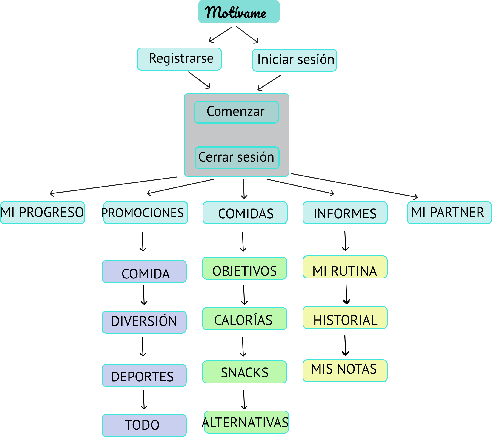

#### **Affinit map**

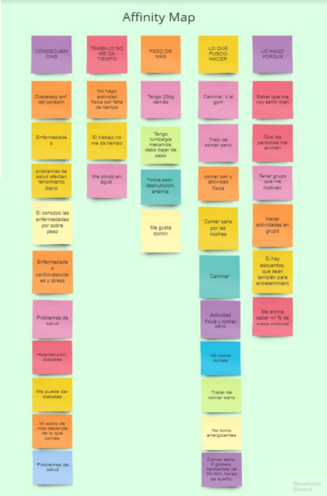

#### **User Person**

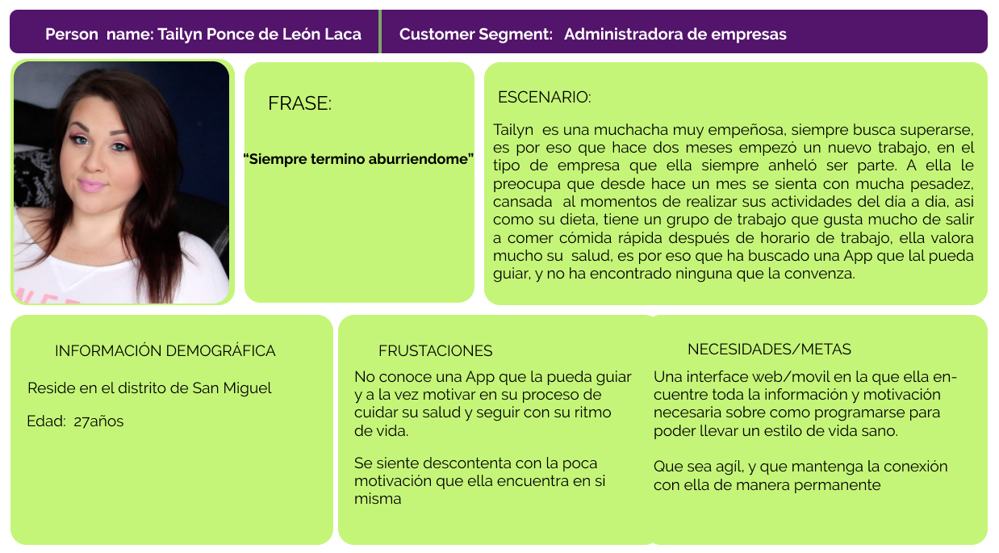

#### **Storyboard**

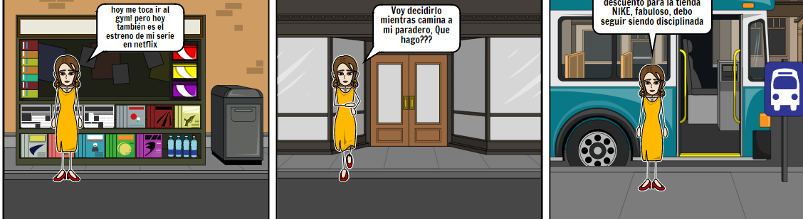
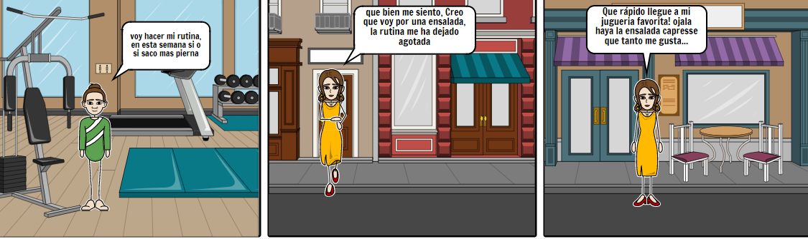

### **Feature List**

- Registro de usuario nuevo.
- Inicio de sesión
- Mis progresos: imágenes de los progresos que se va obteniendo
- Mis promociones: promociones y descuentos que se van obteniendo en diferentes categorías, tales como: comida, diversión, deporte y todo.
- Comidas: Contador de calorías, opciones platillos y Snacks, Todo.
- Informes: rutina, historial, notas 
- Mi partner: solicitud de partner de apoyo

### **Prototype en alta fidelidad**
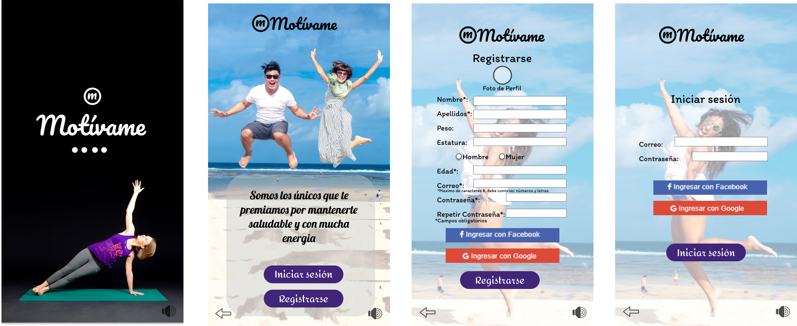

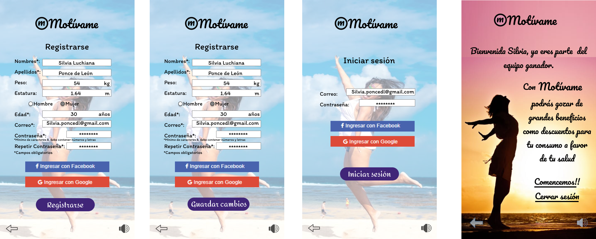

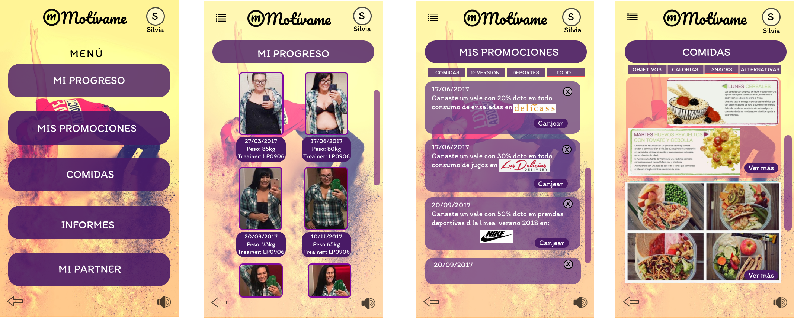

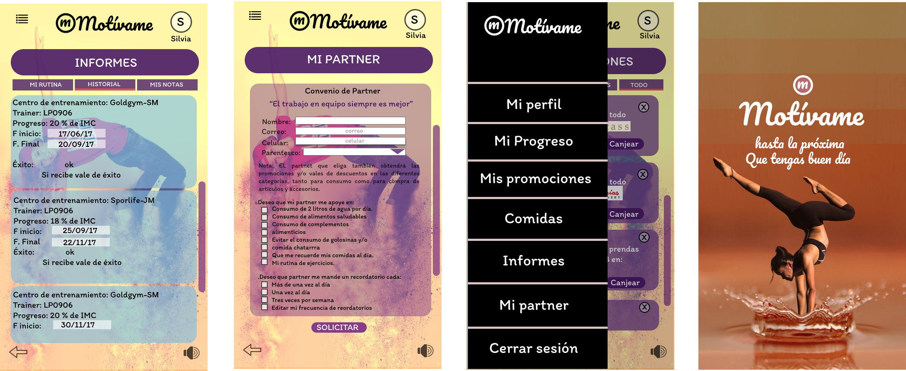
